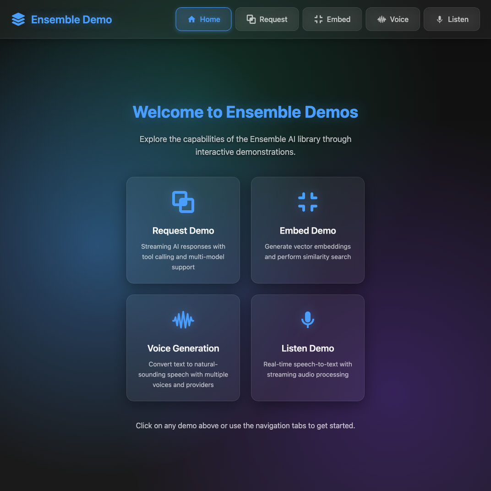

# @just-every/ensemble

[](https://www.npmjs.com/package/@just-every/ensemble)
[](https://github.com/just-every/ensemble/actions)

A simple interface for interacting with multiple LLM providers during a single conversation.

## 🚀 Quick Demo

Try the interactive demos to see Ensemble in action:

```bash
npm run demo
```

This opens a unified demo interface at http://localhost:3000 with all demos:

### Demo Interface


Navigate to http://localhost:3000 to access all demos through a unified interface.

See the [demo README](demo/README.md) for detailed information about each demo.

## Features

- 🤝 **Unified Streaming Interface** - Consistent event-based streaming across all providers
- 🔄 **Model/Provider Rotation** - Automatic model selection and rotation
- 🛠️ **Advanced Tool Calling** - Parallel/sequential execution, timeouts, and background tracking
- 📝 **Automatic History Compaction** - Handle unlimited conversation length with intelligent summarization
- 🤖 **Agent Orientated** - Advanced agent capabilities with verification and tool management
- 🔌 **Multi-Provider Support** - OpenAI, Anthropic, Google, DeepSeek, xAI, OpenRouter, ElevenLabs
- 🖼️ **Multi-Modal** - Support for text, images, embeddings, and voice generation
- 📊 **Cost & Quota Tracking** - Built-in usage monitoring and cost calculation
- 🎯 **Smart Result Processing** - Automatic summarization and truncation for long outputs

## Model Updates (Dec 2025)
- OpenAI: Added GPT-5.2 (base + chat-latest + pro) and refreshed GPT-5.1/GPT-5/Codex pricing
- Anthropic: Claude 4.5 (Sonnet/Haiku, incl. 1M context) and Claude Opus 4.1
- Google: Gemini 3 (Pro/Flash/Ultra) and refreshed Gemini 2.5 pricing incl. image/TTS/native-audio
- xAI: Grok 4.1 Fast and Grok 4 Fast with tiered pricing; updated Grok 4/3/mini variants

*Codex-Max pricing reflects current published rates and may change if OpenAI updates pricing.

## Installation

```bash
npm install @just-every/ensemble
```

## Environment Setup

Copy `.env.example` to `.env` and add your API keys:

```bash
cp .env.example .env
```

Available API keys (add only the ones you need):

```bash
# LLM Providers
OPENAI_API_KEY=your-openai-key
ANTHROPIC_API_KEY=your-anthropic-key  
GOOGLE_API_KEY=your-google-key
XAI_API_KEY=your-xai-key
DEEPSEEK_API_KEY=your-deepseek-key
OPENROUTER_API_KEY=your-openrouter-key

# Voice & Audio Providers  
ELEVENLABS_API_KEY=your-elevenlabs-key

# Search Providers
BRAVE_API_KEY=your-brave-key
```

**Note**: You only need to configure API keys for the providers you plan to use. The system will automatically select available providers based on configured keys.

## Quick Start

```typescript
import { ensembleRequest, ensembleResult } from '@just-every/ensemble';

const messages = [
    { type: 'message', role: 'user', content: 'How many of the letter "e" is there in "Ensemble"?' }
];

// Perform initial request
for await (const event of ensembleRequest(messages)) {
    if (event.type === 'response_output') {
        // Save out to continue conversation
        messages.push(event.message);
    }
}

// Create a validator agent
const validatorAgent = {
    instructions: 'Please validate that the previous response is correct',
    modelClass: 'code',
};
// Continue conversation with new agent
const stream = ensembleRequest(messages, validatorAgent);
// Alternative method of collecting response
const result = await ensembleResult(stream);
console.log('Validation Result:', {
    message: result.message,
    cost: result.cost,
    completed: result.completed,
    duration: result.endTime
        ? result.endTime.getTime() - result.startTime.getTime()
        : 0,
    messageIds: Array.from(result.messageIds),
});
```

## Documentation

- [Tool Execution Guide](docs/tool-execution.md) - Advanced tool calling features
- [Interactive Demos](demo/) - Web-based demos for core features
- Generated [API Reference](docs/api) with `npm run docs`
  
Run `npm run docs` to regenerate the HTML documentation.

## Core Concepts

### Tools

Define tools that LLMs can call:

```typescript
const agent = {
    model: 'o3',
    tools: [{
        definition: {
            type: 'function',
            function: {
                name: 'get_weather',
                description: 'Get weather for a location',
                parameters: {
                    type: 'object',
                    properties: {
                        location: { type: 'string' }
                    },
                    required: ['location']
                }
            }
        },
        function: async (location: string) => {
            return `Weather in ${location}: Sunny, 72°F`;
        }
    }]
};
```

### Streaming Events

All providers emit standardized events:

- `message_start` / `message_delta` / `message_complete` - Message streaming
- `tool_start` / `tool_delta` / `tool_done` - Tool execution
- `cost_update` - Token usage and cost tracking
- `error` - Error handling

### Agent Configuration

Configure agent behavior with these optional properties:

```typescript
const agent = {
    model: 'claude-4-sonnet',
    maxToolCalls: 200,              // Maximum total tool calls (default: 200)
    maxToolCallRoundsPerTurn: 5,    // Maximum sequential rounds of tool calls (default: Infinity)
    tools: [...],                   // Available tools for the agent
    modelSettings: {                // Provider-specific settings
        temperature: 0.7,
        max_tokens: 4096
    }
};
```

Key configuration options:
- `maxToolCalls` - Limits the total number of tool calls across all rounds
- `maxToolCallRoundsPerTurn` - Limits sequential rounds where each round can have multiple parallel tool calls
- `modelSettings` - Provider-specific parameters like temperature, max_tokens, etc.

### Multimodal Input (Images)

For multimodal models, pass content as an array of typed parts. In addition to `input_text` and `input_image`, Ensemble now accepts a simpler `image` part that can take base64 data or a URL.

Supported image fields:
- `type: 'image'`
- `data`: base64 string **or** full `data:<mime>;base64,...` URL
- `url`: http(s) URL
- `file_id`: provider file reference (when supported)
- `mime_type`: image mime type (recommended when passing raw base64)
- `detail`: `high` | `low` | `auto` (for providers that support detail hints)

```ts
import { ensembleRequest } from '@just-every/ensemble';

const messages = [
  {
    type: 'message',
    role: 'user',
    content: [
      { type: 'input_text', text: 'Describe this image.' },
      { type: 'image', data: myPngBase64, mime_type: 'image/png' }
      // or: { type: 'image', url: 'https://example.com/cat.png' }
    ],
  },
];

for await (const event of ensembleRequest(messages, { model: 'gemini-3-flash-preview' })) {
  if (event.type === 'message_complete' && 'content' in event) {
    console.log(event.content);
  }
}
```

### Structured JSON Output

Use `modelSettings.json_schema` to request a JSON-only response. The schema is validated by providers that support it.

The example below combines **image input** with **JSON output**:

```ts
import { ensembleRequest, ensembleResult } from '@just-every/ensemble';

const agent = {
  model: 'gemini-3-flash-preview',
  modelSettings: {
    temperature: 0.2,
    json_schema: {
      name: 'image_analysis',
      type: 'json_schema',
      schema: {
        type: 'object',
        properties: {
          dominant_color: { type: 'string' },
          confidence: { type: 'number' },
        },
        required: ['dominant_color', 'confidence'],
      },
    },
  },
};

const messages = [
  {
    type: 'message',
    role: 'user',
    content: [
      { type: 'input_text', text: 'Analyze this image and return JSON.' },
      { type: 'image', data: myPngBase64, mime_type: 'image/png' },
    ],
  },
];

const result = await ensembleResult(ensembleRequest(messages, agent));
const parsed = JSON.parse(result.message);
console.log(parsed.dominant_color, parsed.confidence);
```

### Advanced Features

- **Parallel Tool Execution** - Tools run concurrently by default within each round
- **Sequential Mode** - Enforce one-at-a-time execution
- **Timeout Handling** - Automatic timeout with background tracking
- **Result Summarization** - Long outputs are intelligently summarized
- **Abort Signals** - Graceful cancellation support

### Voice Generation

Generate natural-sounding speech from text using Text-to-Speech models:

```typescript
import { ensembleVoice, ensembleVoice } from '@just-every/ensemble';

// Simple voice generation
const audioData = await ensembleVoice('Hello, world!', {
    model: 'tts-1' // or 'gemini-2.5-flash-preview-tts'
});

// Voice generation with options
const audioData = await ensembleVoice('Welcome to our service', {
    model: 'tts-1-hd'
}, {
    voice: 'nova',        // Voice selection
    speed: 1.2,          // Speech speed (0.25-4.0)
    response_format: 'mp3' // Audio format
});

// Streaming voice generation
for await (const event of ensembleVoice('Long text...', {
    model: 'gemini-2.5-pro-preview-tts'
})) {
    if (event.type === 'audio_stream') {
        // Process audio chunk
        processAudioChunk(event.data);
    }
}
```

**Supported Voice Models:**
- OpenAI: `tts-1`, `tts-1-hd`
- Google Gemini: `gemini-2.5-flash-preview-tts`, `gemini-2.5-pro-preview-tts`

### Image generation

Use OpenAI GPT-Image-1 (or the new cost-efficient GPT-Image-1 Mini) or Google Gemini 2.5 Flash Image (Preview):

```ts
import { ensembleImage } from '@just-every/ensemble';

const images = await ensembleImage('A serene lake at dawn', { model: 'gemini-2.5-flash-image-preview' }, { size: 'portrait' });
```
- ElevenLabs: `eleven_multilingual_v2`, `eleven_turbo_v2_5`

## Development

```bash
# Install dependencies
npm install

# Run tests
npm test

# Build
npm run build

# Generate docs
npm run docs

# Lint
npm run lint
```

Additional image providers

New providers added
- Fireworks AI (FLUX family: Kontext/Pro/Schnell) – async APIs with result polling. Docs: Fireworks Image API.
- Stability AI (Stable Image Ultra/SDXL) – REST v2beta endpoints supporting text-to-image and image-to-image.
- Runway Gen-4 Image – via FAL.ai.
- Recraft v3 – via FAL.ai (supports text-to-vector and vector-style outputs).

Environment
```
FIREWORKS_API_KEY=your_key
STABILITY_API_KEY=your_key
FAL_KEY=your_key
```

Fallbacks
- If Fireworks returns 401/403 or is not configured, requests for Flux-family models automatically fall back to FAL.ai equivalents when `FAL_KEY` is set.

- Luma Photon (official): set `LUMA_API_KEY` and use `luma-photon-1` or `luma-photon-flash-1`.
- Ideogram 3.0 (official): set `IDEOGRAM_API_KEY` and use `ideogram-3.0`.
- Midjourney v7 (3rd-party): set `MIDJOURNEY_API_KEY` (or `KIE_API_KEY`) and optional `MJ_API_BASE`; use `midjourney-v7`.

Notes
- Gemini Flash Image does not expose hard size/AR controls; we add soft prompt hints and return the image unchanged.
- Luma Photon and Ideogram return URLs; we pass them through without altering pixels.

## Architecture

Ensemble provides a unified interface across multiple LLM providers:

1. **Provider Abstraction** - All providers extend `BaseModelProvider`
2. **Event Streaming** - Consistent events across all providers
3. **Tool System** - Automatic parameter mapping and execution
4. **Message History** - Intelligent conversation management
5. **Cost Tracking** - Built-in usage monitoring

## Contributing

Contributions are welcome! Please:

1. Fork the repository
2. Create a feature branch
3. Add tests for new features
4. Submit a pull request

## Troubleshooting

### Provider Issues
- Ensure API keys are set correctly
- Check rate limits for your provider
- Verify model names match provider expectations

### Tool Calling
- Tools must follow the OpenAI function schema
- Ensure tool functions are async
- Check timeout settings for long-running tools

### Streaming Issues
- Verify network connectivity
- Check for provider-specific errors in events
- Enable debug logging with `DEBUG=ensemble:*`

## License

MIT
