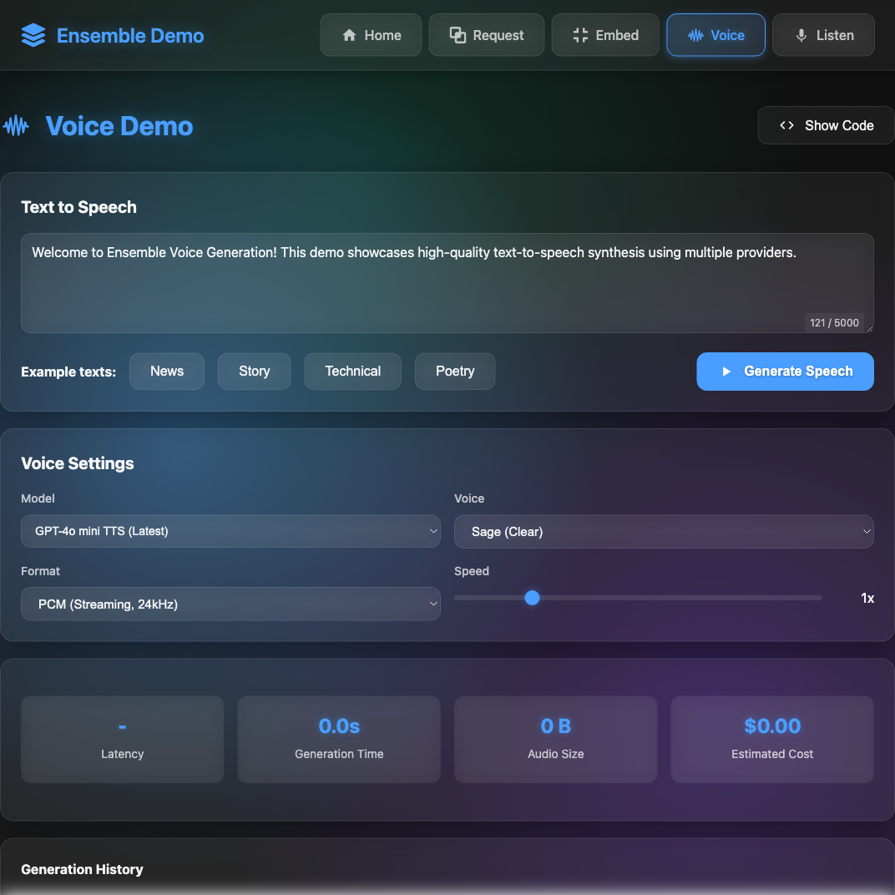
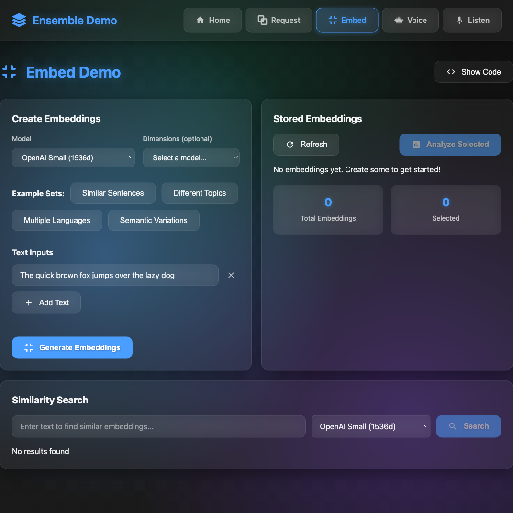

# Ensemble Demos

Interactive demos showcasing the capabilities of `@just-every/ensemble` - a unified LLM provider abstraction layer.


## Available Demos

### 🔄 Request Demo
Demonstrates the streaming request interface with real-time conversation capabilities, tool calling, and cost tracking across multiple providers.


**Features:**
- Real-time streaming responses
- Multi-provider model selection by class (mini, standard, large)
- Tool calling with parallel execution
- Token usage and cost tracking
- Request history and debugging

### 🎤 Voice Demo
Text-to-speech synthesis using multiple providers (OpenAI, ElevenLabs, Google Gemini).



**Features:**
- Multiple voice options per provider
- Real-time audio streaming
- Various output formats (PCM, WAV, MP3, etc.)
- Speed control and audio quality settings
- Generation history with playback

### 🎧 Listen Demo
Real-time speech-to-text transcription with live audio streaming.


**Features:**
- Live microphone recording
- Real-time transcription streaming
- Audio visualization
- Multiple transcription models
- Low-latency processing

### 📊 Embed Demo
Text embedding generation for semantic search and similarity comparisons.



**Features:**
- Multiple embedding models
- Batch text processing
- Semantic similarity comparison
- Vector dimension customization
- Cost tracking

## Running the Demos

1. **Install dependencies:**
   ```bash
   npm install
   ```

2. **Set up environment variables:**
   ```bash
   cp .env.example .env
   # Add your API keys for providers you want to test
   ```

3. **Start the demo servers:**
   ```bash
   npm run demo
   ```

   This starts:
   - Frontend dev server on http://localhost:3000
   - WebSocket servers on ports 3004-3008

4. **Open in browser:**
   Navigate to http://localhost:3000

## Architecture

The demos use a WebSocket architecture for real-time streaming:

- **Frontend**: React + TypeScript with glassmorphism UI
- **Backend**: Node.js WebSocket servers using the ensemble library
- **Streaming**: Real-time event streaming for all operations
- **State Management**: Custom hooks for conversation and task state

## Configuration

Each demo can be configured with:
- **Provider API Keys**: Set in `.env` file
- **Model Selection**: Choose models by class or specific model
- **Advanced Settings**: Temperature, tool calling, format options
- **UI Preferences**: Theme and layout customization

## Development

To modify the demos:

1. **Frontend code**: `demo/src/`
2. **Backend servers**: `demo/servers/`
3. **Shared UI components**: `demo/src/components/`
4. **Styles**: SCSS with CSS variables for theming

The demos showcase best practices for integrating ensemble into your applications.